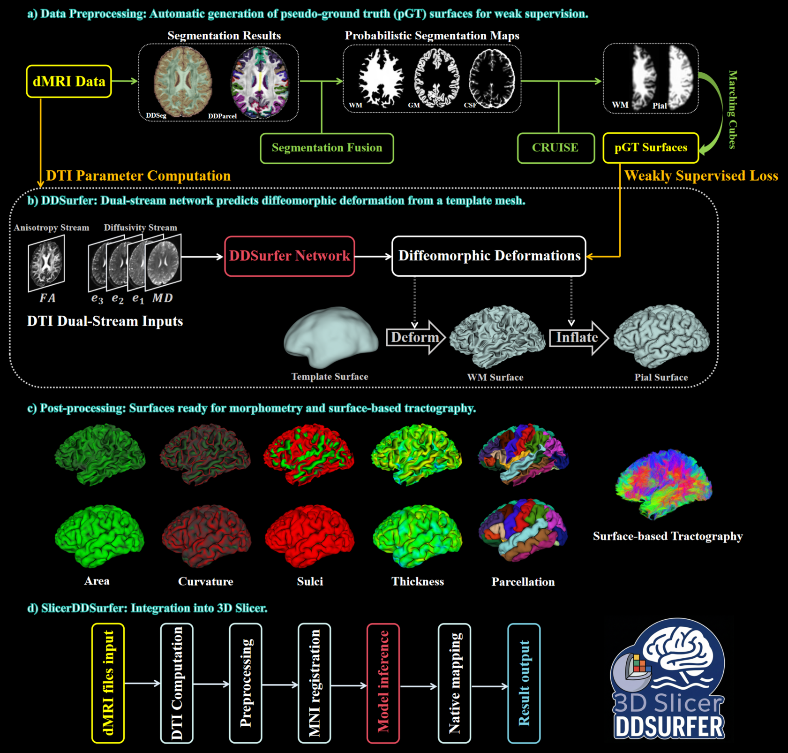

<div align="center">

# DDSurfer

**Cortical surface reconstruction from diffusion MRI**

[](#key-dependencies)
[](#key-dependencies)
[](#key-dependencies)
[](#key-dependencies)
[](#key-dependencies)
[](#optional-postprocessing)

[Publication](#publication) | [Overview](#overview) | [Installation](#installation) | [Run DDSurfer](#run-ddsurfer) | [Postprocessing](#optional-postprocessing) | [Dependencies](#key-dependencies)

</div>

DDSurfer reconstructs white and pial cortical surfaces from diffusion MRI.
Preprocessing, surface inference and optional postprocessing are provided in
one workflow, with model weights loaded automatically from `weights/`.

**Diffusion MRI in. White and pial surfaces for both hemispheres out.**

---

## Publication

DDSurfer is published in **Advanced Science**:

> Chengjin Li, Wei Zhang, Xi Zhu, Yuqian Chen, Nir A. Sochen, Jarrett Rushmore,
> Carl-Fredrik Westin, Yogesh Rathi, Lauren J. O'Donnell, Ofer Pasternak, and
> Fan Zhang. ["DDSurfer: A Weakly-Supervised Dual-Stream Deep Learning Framework
> for Cortical Surface Reconstruction From Diffusion MRI."](https://doi.org/10.1002/advs.76596)
> *Advanced Science* **13**(56), e76596 (2026).

If you use DDSurfer in academic research, please cite our paper.
Machine-readable citation information is available in [CITATION.cff](CITATION.cff).

### Citation (BibTeX)

```bibtex
@article{Li2026DDSurfer,
  author  = {Li, Chengjin and Zhang, Wei and Zhu, Xi and Chen, Yuqian and
             Sochen, Nir A. and Rushmore, Jarrett and Westin, Carl-Fredrik and
             Rathi, Yogesh and O'Donnell, Lauren J. and Pasternak, Ofer and
             Zhang, Fan},
  title   = {DDSurfer: A Weakly-Supervised Dual-Stream Deep Learning Framework
             for Cortical Surface Reconstruction From Diffusion MRI},
  journal = {Advanced Science},
  year    = {2026},
  volume  = {13},
  number  = {56},
  pages   = {e76596},
  doi     = {10.1002/advs.76596},
  url     = {https://doi.org/10.1002/advs.76596}
}
```

---

## Overview



**DDSurfer at a glance.** Weak supervision, white and pial surface reconstruction,
surface-based analysis and integration with 3D Slicer.

---

## Installation

Clone the repository and enter the project directory:

```bash
git clone https://github.com/ChengjinLii/DDSurfer.git
cd DDSurfer
```

The model weights are included in the repository. Set up the
[Python environment](#python-environment) and install the required
[external applications](#key-dependencies) before running the pipeline.
Run the commands below from the repository root.

---

## Inputs

Provide corrected 4D DWI, bval, bvec and a brain mask on the same native voxel
grid. No precomputed DTI or structural MRI is required. If a mask is unavailable,
enable [optional brain masking](#optional-brain-masking); it is off by default.

```text
inputs/<subID>/
  dwi.nii.gz
  dwi.bval
  dwi.bvec
  mask.nii.gz
```

**Before running:** motion, eddy-current and susceptibility correction, together
with the corresponding gradient updates, must already be done.

---

## Run DDSurfer

### Quick Start

From the repository root:

```bash
python3 run_ddsurfer_pipeline.py --subject <subID>
# Equivalent shell entry point:
bash run_ddsurfer_pipeline.sh --subject <subID>
```

For files stored elsewhere:

```bash
python3 run_ddsurfer_pipeline.py --subject <subID> \
  --dwi ./data/dwi.nii.gz --bval ./data/dwi.bval \
  --bvec ./data/dwi.bvec --mask ./data/mask.nii.gz
```

### Workflow

`DWI -> DTI features -> MNI inference -> native surfaces`

Preprocessing runs automatically before surface prediction.

Default paths:

- Inputs: `inputs/<subID>/`
- Outputs: `outputs/<subID>/`

### Common Options

| Option | Usage |
| --- | --- |
| `--raw-input-root <path>` | Change the input directory. |
| `--output-root <path>` | Change the output directory. |
| `--device cuda:0` or `--device cpu` | Select GPU or CPU inference. |
| `--precision fp32` | Default on CPU and GPU; use the same precision across devices. |
| `--precision bf16` | Optional mixed precision to reduce GPU memory use; requires BF16-capable CUDA hardware. |
| `--precision auto` | Follow the model manifest on CUDA (FP32 for the bundled models); FP32 on CPU. |
| `--cpu-threads 4` | CPU thread budget for inference; default: 4. |
| `--max-gpu-gib 24` | GPU allocation budget for inference in GiB; default: 24. |
| `--auto-mask` | Generate a missing brain mask with FreeSurfer SynthStrip; default: off. |
| `--preprocess-jobs 2` | Run independent DTI stages concurrently; default: 1. |
| `--post-process` | Enable optional FreeSurfer postprocessing; default: off. |
| `--keep-cache` | Retain intermediate files and detailed stage logs. |
| `--resume` | Reuse completed, checksum-verified results, even after cache cleanup. |

Before image processing starts, the pipeline checks inputs, model assets,
device/precision support and the required Slicer modules. FreeSurfer tools,
license and atlas files are checked only when postprocessing is requested;
automatic masking checks SynthStrip separately. A subject-wide lock prevents
two main-pipeline runs from writing or cleaning the same output directory.

The resource limits apply to **inference**, not registration or postprocessing.
CUDA inference requires a budget of at least 8 GiB, plus a 4-GiB free-memory
margin. Preflight cannot reserve the GPU against other processes.

### CPU and GPU Precision

CPU and GPU inference use the **same models and coordinate transforms**, with
**FP32 by default**. Results should be close, but are not guaranteed to be bitwise
identical across devices.

To use FP32 on either device:

```bash
python3 run_ddsurfer_pipeline.py --subject <subID> --device cpu --precision fp32
python3 run_ddsurfer_pipeline.py --subject <subID> --device cuda:0 --precision fp32
```

If GPU memory is insufficient, explicitly select BF16 on supported hardware:

```bash
python3 run_ddsurfer_pipeline.py --subject <subID> --device cuda:0 --precision bf16
```

There is no automatic precision downgrade. BF16 reduces numerical precision and
can change surface coordinates; it is not merely a faster execution mode.

Compare devices using identical preprocessed inputs, weights and settings.
See [PyTorch's numerical accuracy guidance](https://docs.pytorch.org/docs/stable/notes/numerical_accuracy.html).

### Cache and Reuse

DTI maps and surfaces are saved automatically. Intermediate cache is removed
after success; failed runs retain it for diagnosis. Source inputs are never
modified or removed.

To reuse final results without retaining the cache:

```bash
python3 run_ddsurfer_pipeline.py --subject <subID> --resume
```

Reuse requires a successful run record, matching inputs, weights, templates,
settings and implementation, and intact output checksums. Otherwise, the
pipeline attempts a normal run; existing cache/input safety checks still apply.
Older results without a reuse record are not skipped. Keep the original run
options when adding `--resume`; reuse does not recreate a deleted cache.

`--skip-preprocessing` instead uses an existing retained preprocessing cache.
It cannot be combined with `--resume`.

To verify the bundled weights:

```bash
(cd weights && sha256sum -c SHA256SUMS)
```

---

## Optional Brain Masking

If no mask is available, add `--auto-mask`:

```bash
python3 run_ddsurfer_pipeline.py --subject <subID> --auto-mask
# Or supply the three diffusion files explicitly:
python3 run_ddsurfer_pipeline.py --subject <subID> --auto-mask \
  --dwi ./data/dwi.nii.gz --bval ./data/dwi.bval --bvec ./data/dwi.bvec
```

- **Default: off.** Without this option, a mask is required.
- **Method:** FreeSurfer `mri_synthstrip` on the mean b0 image (`b <= 50`).
- **Setup:** configure `FREESURFER_HOME`, or pass `--freesurfer-home <path>`.
- **Execution:** CPU only; `--mask-threads 4` sets the thread budget.
- **Output:** `dti/<subID>-brainmask.nii.gz`, retained after cache cleanup.

A supplied mask always takes priority. Automatic masking neither replaces it
nor enables surface postprocessing. Inspect the generated mask before using
the results in an analysis; it need not match a manually supplied mask.
See [mask generation and validation](preprocessing/README.md#optional-brain-masking).

---

## Outputs

DTI maps, reconstructed surfaces and concise logs are retained for every run.
The FreeSurfer analysis directories are added **only with `--post-process`**:

```text
outputs/<subID>/
  dti/
    <subID>-FA.nii.gz
    <subID>-MD.nii.gz
    <subID>-MinEigenvalue.nii.gz
    <subID>-MidEigenvalue.nii.gz
    <subID>-MaxEigenvalue.nii.gz
    <subID>-Trace.nii.gz
    <subID>-brainmask.nii.gz   if generated with --auto-mask
  ddsurfer/
    lh.white.obj
    lh.pial.obj
    rh.white.obj
    rh.pial.obj
  surf/                      optional postprocessing
    lh.white, lh.pial, rh.white, rh.pial
    lh.curv, lh.sulc, lh.thickness, lh.area
    lh.inflated, lh.sphere, lh.sphere.reg
    rh.*                     corresponding right-hemisphere results
  label/                     optional cortex labels and parcellations
    lh.cortex.label, rh.cortex.label
    lh.aparc.annot, rh.aparc.annot
    lh.aparc.a2009s.annot, rh.aparc.a2009s.annot
  stats/                     optional regional surface statistics
    lh.aparc.stats, rh.aparc.stats
    lh.aparc.a2009s.stats, rh.aparc.a2009s.stats
  fsaverage/                 optional standard-surface overlays
    lh.thickness.mgh, rh.thickness.mgh, ...
  mri/                       optional FreeSurfer reference volumes
    brain.mgz, orig.mgz
  logs/                      run summary and execution logs
```

Atlas and hemisphere selections determine which postprocessing files appear.
See the [postprocessing output guide](postprocessing/README.md#outputs) for
file types and interpretation.

---

## Optional Postprocessing

### Run with DDSurfer

Postprocessing is **disabled by default**. Configure `FREESURFER_HOME` and
`FS_LICENSE`, then add `--post-process`:

```bash
python3 run_ddsurfer_pipeline.py --subject <subID> --post-process
```

`--postprocess-hemi left` or `right` selects one hemisphere;
`--postprocess-atlases aparc` selects one atlas. Otherwise both hemispheres
and the `aparc,aparc.a2009s` atlases are processed.

### Use Your Own Surfaces

**DDSurfer postprocessing is plug-and-play and can be used independently.**
Its only required data inputs are four native cortical surfaces: left/right
white and pial. They may be reconstructed by DDSurfer, FreeSurfer, FastSurfer
or another method; DWI, DTI and structural MRI are not required. FreeSurfer,
its license, and `fsaverage` must be configured.

```bash
bash postprocessing/run.sh --subject <subID> \
  --lh-white ./outputs/<subID>/ddsurfer/lh.white.obj \
  --lh-pial ./outputs/<subID>/ddsurfer/lh.pial.obj \
  --rh-white ./outputs/<subID>/ddsurfer/rh.white.obj \
  --rh-pial ./outputs/<subID>/ddsurfer/rh.pial.obj
```

The four surfaces must share native scanner-RAS millimetre coordinates.
Each white/pial pair must preserve vertex correspondence and topology.
Indexed OBJ/PLY/OFF, STL and FreeSurfer binary surfaces are supported.
Paired STL inputs must preserve corresponding triangle order.
No nearest-neighbour correspondence is guessed.

### Postprocessing Results

Postprocessing adds curvature, sulcal depth, thickness, surface area, inflated
and spherical surfaces, cortical parcellations, regional statistics and
`fsaverage` overlays. The directory layout is shown in [Outputs](#outputs).

Without an MRI, the reference under `mri/` contains geometry only, not acquired
or synthesized anatomical intensities. No segmentation-derived tissue volumes
are reported. See [postprocessing usage](postprocessing/README.md) for details.

---

## Key Dependencies

| Component | Purpose | Requirement |
| --- | --- | --- |
| Python 3.8+ | Pipeline and utilities | Required |
| PyTorch, torchvision | Surface inference | Required; CUDA optional |
| NumPy, SciPy, SimpleITK, nibabel, trimesh, pynrrd | Image and surface processing | Required |
| Slicer with SlicerDMRI | Raw-DWI processing | Set `SLICER_PATH` or put `Slicer` on `PATH` |
| FreeSurfer | Optional masking and surface postprocessing | `mri_synthstrip` for masking; license and `fsaverage` for postprocessing |

### Python Environment

Python dependencies for preprocessing, inference and postprocessing are defined
in [`requirements.txt`](requirements.txt) at the repository root. The root
[`environment.yml`](environment.yml) creates a `ddsurfer` conda environment
and installs the same requirements. From the repository root:

```bash
conda env create -f environment.yml
conda activate ddsurfer
```

Alternatively, install into an existing compatible Python environment:

```bash
python -m pip install -r requirements.txt
```

Slicer/SlicerDMRI and optional FreeSurfer are external applications and must be
installed separately; they are not provided by these Python dependency files.

---

## Slicer Extension

**SlicerDDSurfer will be open-sourced soon** at
[ChengjinLii/SlicerDDSurfer](https://github.com/ChengjinLii/SlicerDDSurfer).

Surface OBJ files declare `SPACE=RAS` in their header for automatic coordinate
selection in 3D Slicer. For older outputs without this declaration, select
**RAS** in the Add Data options when loading the surfaces.

---

## License

DDSurfer is released under the [MIT License](LICENSE). Third-party components
and external tools remain subject to their respective licenses.

---

## Support

For questions, bug reports or feature requests, please open a
[GitHub issue](https://github.com/ChengjinLii/DDSurfer/issues).

---

## Acknowledgments

This work is supported in part by the National Key R&D Program of China
(No. 2023YFE0118600) and the National Natural Science Foundation of China
(No. 62371107).
